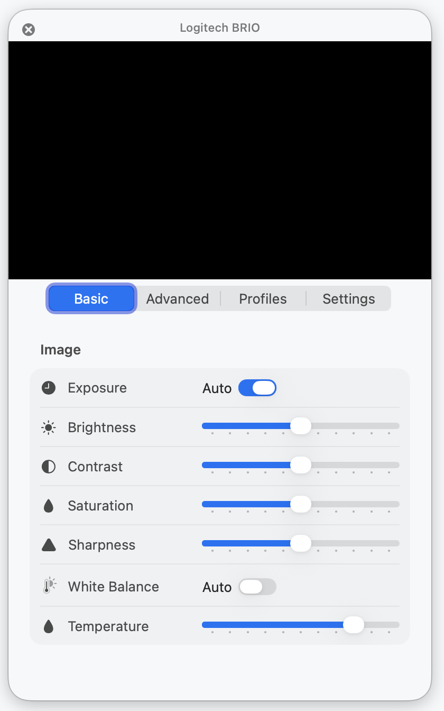
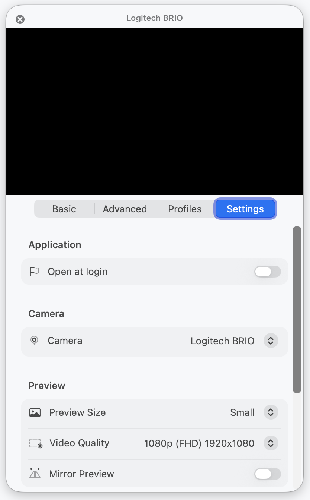

<h1 align="center"> BrioControl </h1>

<!-- subtext -->
<div align="center">
Control your cameras settings without using the software provided (or not) by the company.
</div>

<br/>

<!-- shields -->
<div align="center">
    <!-- license -->
    <a href="https://github.com/Toukaya/BrioControl/blob/master/LICENSE">
        
    </a>
    <!-- platform -->
    <a href="https://github.com/Toukaya/BrioControl">
        
    </a>
    <!-- swift version -->
    <a href="https://github.com/Toukaya/BrioControl">
        
    </a>
    <!-- upstream -->
    <a href="https://github.com/itaybre/CameraController">
        
    </a>
</div>

<br/>

<div align="center">
    
    
</div>

## About this fork

BrioControl is a fork of [itaybre/CameraController](https://github.com/itaybre/CameraController) re-targeted at Apple Silicon, macOS 26 (Tahoe), Swift 6, and the Liquid Glass design language, with first-class support for the Logitech BRIO's vendor extension units. It remains under GPL v3, the same license as the upstream project. BrioControl is not affiliated with, endorsed by, or sponsored by Logitech; "BRIO" is a trademark of Logitech Inc.

### What changed since the fork point

#### Toolchain & architecture
- **Swift 6 + macOS 26 deployment target.** Strict concurrency mode (`SWIFT_STRICT_CONCURRENCY = complete`) plus warnings-as-errors (`SWIFT_TREAT_WARNINGS_AS_ERRORS = YES`) on the app and helper targets; build is clean at 0 warnings, 0 SwiftLint violations.
- **SwiftUI `App` entry.** Replaced `@NSApplicationMain` with `@main struct` and a dedicated `Settings { ... }` scene driven via `@NSApplicationDelegateAdaptor`.
- **`@Observable` macro everywhere.** Every model class migrated from Combine `ObservableObject` / `@Published` to the Observation framework; views use `@Bindable` / `@Environment`. Removes the "Publishing changes from within view updates" runtime warning class entirely.
- **`UVCDeviceActor` for race-free hardware I/O.** All UVCControl reads and writes funneled through a per-device `actor`. Slider drags can no longer interleave their underlying USB control transfers. `nonisolated(unsafe)` escape hatches reduced to six well-commented sites (CFUUID constants + AVCaptureDevice equality), with unit tests covering write-serialization.
- **`PreviewSession` isolation.** A `@MainActor @Observable` type owns the entire `AVCaptureSession` lifecycle (configure / attach / detach / change-quality / suspend / resume); blocking `start/stopRunning` calls are dispatched onto a dedicated serial queue so the main actor stays responsive on cold-camera startup.
- **Login item via `SMAppService`.** Migrated off the deprecated `SMLoginItemSetEnabled` API.
- **Camera permission deferred.** Permission prompt now fires lazily on the first `PreviewSession.attach`, not at app launch.

#### UI rewrite
- **Settings rebuilt around `Form` + `Section` + `LabeledContent`.** Native HIG layout replaces the prior hand-built `SectionView` / `SectionTitle` / `GenericControl` / custom `Slider` & `Toggle` / `AutoBadge` / `TabSelectorView` / `VisualEffectView` scaffolding (all eight files removed).
- **Menu-bar popover with the macOS 26 Liquid Glass arrow tail.** Migrated through `MenuBarExtra(.window)` and back to `NSStatusItem` + `NSPopover` once it became clear no SwiftUI `MenuBarExtraStyle` exposes the popover-arrow chrome on macOS 26. Drag-to-detach, transient dismiss, and Liquid Glass material are all native.
- **Native segmented `Picker` navigation.** Top-of-popover section switcher driven by a `@State Section` enum + `@ViewBuilder switch`, replacing the SwiftUI `TabView` chrome that didn't sit cleanly inside an NSPopover.
- **Auto-toggle reveal pattern.** Exposure / Focus / White Balance / Hue rows have a header row with the feature label and the native Auto switch; manual sliders expand below as labelled child rows when Auto is off.
- **Camera name header above the preview frame.** Squared corners (no rounded clip) so it sits flush against the popover edges.
- **Profile row uses an ellipsis Menu** (Apply / Delete) instead of hover-revealed icons; profile list is a fixed-height `List` so popover height stays stable.
- **Slider step granularity.** New `tickStep = max(resolution, span / 10)` on `NumberCaptureDeviceProperty` and `MultipleCaptureDeviceProperty` so sliders snap to ~10 detents instead of single-unit precision over hundreds-wide ranges.

#### Logitech BRIO vendor controls
- **Field of View** picker (90° / 78° / 65°), wired through XU 6 / selector 0x03.
- **HDR toggle.** Confirmed via USB capture from Logi Tune: XU GUID `5A6D654C-7E35-4D4E-810D-069D15E0F79B`, selector `0x01`, 6-byte payload where `byte[0]` toggles HDR while `bytes[1..5]` are vendor companion data preserved on every write. Implemented as a `LogitechHDRControl` subclass that does a read-modify-write so the trailing bytes never get clobbered.
- **VC Extension Unit descriptor parser.** Independent second pass over the configuration descriptor that catalogs every Extension Unit (GUID + bmControls) for diagnostics and selector probing; defensive against zero-length descriptors and non-VC interfaces.
- RightLight UI was prototyped, then removed pending vendor protocol confirmation; the XU plumbing remains in place.

#### Project hygiene
- **Renamed `CameraController` → `BrioControl`** (Xcode project, target, scheme, source/test directories, bundle identifiers `com.toukaya.BrioControl{,.Helper}`, Info.plist `CFBundleDisplayName`).
- **Xcode 26 project-format upgrade**, predictable PBX file IDs replaced with random 24-hex IDs, swiftlint complexity / function-body-length violations resolved structurally (helper extraction in `IOUSBConfigurationDescriptorPtr+UVC.swift`, `Snapshots` struct in `DeviceController.swift`).

## Building from source

BrioControl is currently source-only — there are no published binaries, no signed release `.zip`, and no Homebrew cask. Build it locally with:

### Required

- macOS 26 (Tahoe) or later
- Xcode 26 or later
- [SwiftLint](https://github.com/realm/SwiftLint) (used as a Run Script build phase)

```sh
git clone https://github.com/Toukaya/BrioControl.git
cd BrioControl
xcodebuild -scheme BrioControl -configuration Release build
```

Or open `BrioControl.xcodeproj` in Xcode and run.

## FAQ

- **Does it work with Apple's FaceTime camera?**
  On older Intel Macs without the T1/T2 chip it will work; T1/T2/Apple Silicon FaceTime cameras require a special entitlement only available to Apple.

## Support
- **macOS 26 (Tahoe)** only. The deployment target is `26.0` so the codebase can use Swift 6 strict concurrency, the Observation framework, the macOS 26 Liquid Glass APIs (`GlassEffectContainer`, `.glassEffect()`), `SMAppService`, and the modern `MenuBarExtra` / `NSPopover` chrome unconditionally.
- Works with any camera controllable via [UVC](https://www.usb.org/document-library/video-class-v15-document-set), with first-class support for Logitech BRIO vendor extension units (Field of View, HDR).

## Contributors
- [@Toukaya](https://github.com/Toukaya) (BrioControl fork maintainer)
- [@itaybre](https://github.com/itaybre) (upstream CameraController author)
- Icons by [@herrerajeff](https://github.com/herrerajeff)
